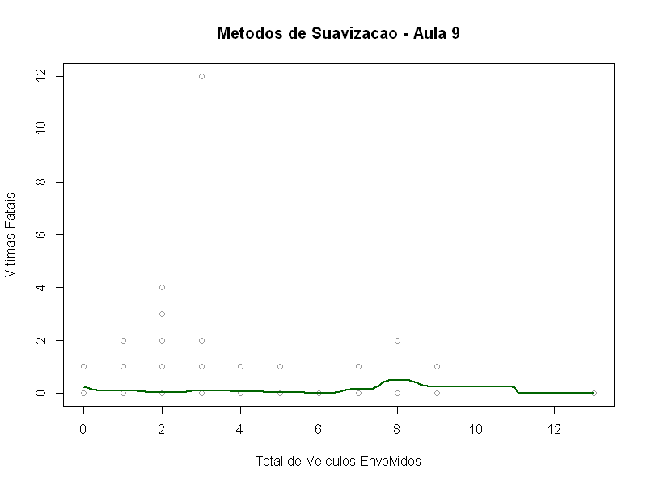

# Atividade 08: Métodos de Suavização

Esta atividade aplica três métodos preditivos para um preditor numérico e a variável resposta, explorando Reta, KNN e Kernel Smoothing para identificar formas funcionais não-lineares nos dados do projeto.

## Parâmetros e Resultados da Validação Cruzada

O modelo utilizou **`veiculos`** (quantidade de veículos envolvidos) como preditor (`x`) e **`qtd_gravidade_fatal`** como variável resposta (`y`), numa amostra computacional de 10.000 boletins válidos extraída de `Sinistros_2025_2026.csv`.

* **Reta de regressão:** 
  * Erro de Validação Cruzada (MSE): **0,0766**
* **KNN-Regressão:** 
  * Melhor hiperparâmetro: **$k = 20$** vizinhos
  * Erro de Validação Cruzada (MSE): **0,0768**
* **Kernel Smoothing (Nadaraya-Watson):**
  * Melhor largura de banda: **$h \approx 0,292$**
  * Erro de Validação Cruzada (MSE): **0,0762**

## Visualização

A curva resultante do suavizador Kernel, configurada com a banda ótima identificada pelo CV, pode ser vista abaixo contra a base de pontos (em cinza).

## Conclusão de Forma

O erro da reta de regressão empata com os métodos não paramétricos em escala prática. **A relação pode ser considerada linear (ou constante); ficamos com a reta, por aplicar a navalha de Occam a erros virtualmente idênticos.**
